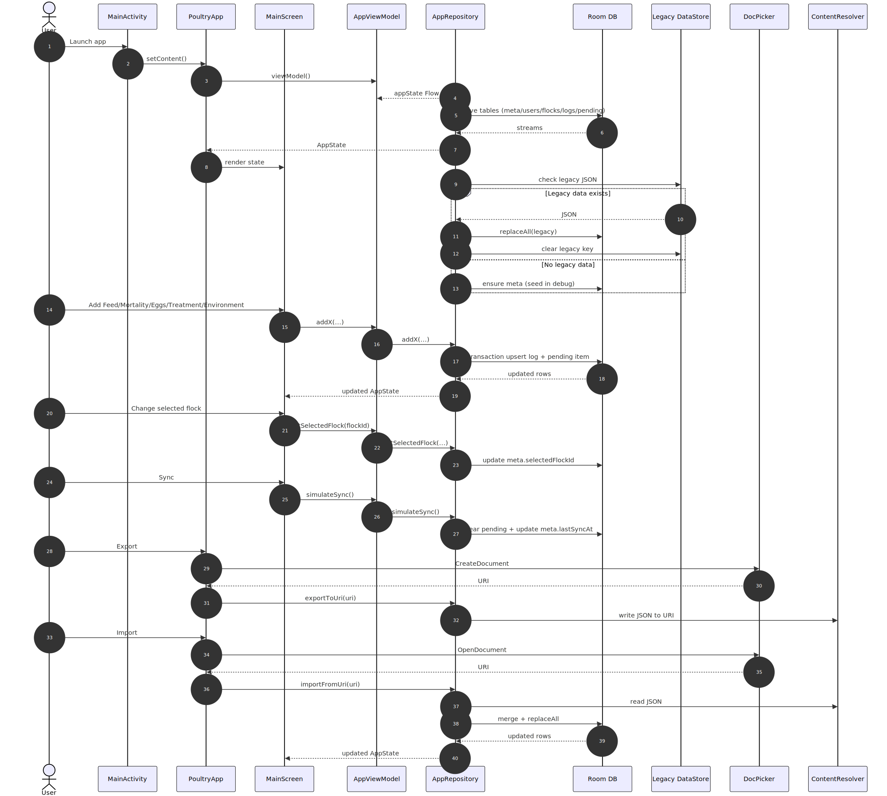

# Data Collect (Poultry Farm)

Offline-first Android app for capturing poultry farm operations data with a Compose UI.

## Diagram



## Architecture

- UI: Jetpack Compose screens in `app/src/main/java/com/example/data_collect/ui`
- State: `AppViewModel` exposes `StateFlow<AppState>` to the UI
- Data: `AppRepository` aggregates Room flows into `AppState`, handles import/export
- Storage: Room DB (entities, DAO, database, mappers) in `app/src/main/java/com/example/data_collect/data/local`
- Migration: legacy JSON in DataStore is migrated once into Room on startup

## Data Model

- `AppState` is the root snapshot: farm info, flocks, logs, pending queue, and selection/sync metadata
- Core entities: `User`, `Flock`
- Log types: `FeedLog`, `MortalityLog`, `EggLog`, `TreatmentLog`, `EnvLog`
- `PendingItem` acts as the offline outbox for future sync

## Build

```bash
./gradlew :app:assembleDebug
```

## Notes

- Mermaid source lives at `docs/sequence.mmd`.
