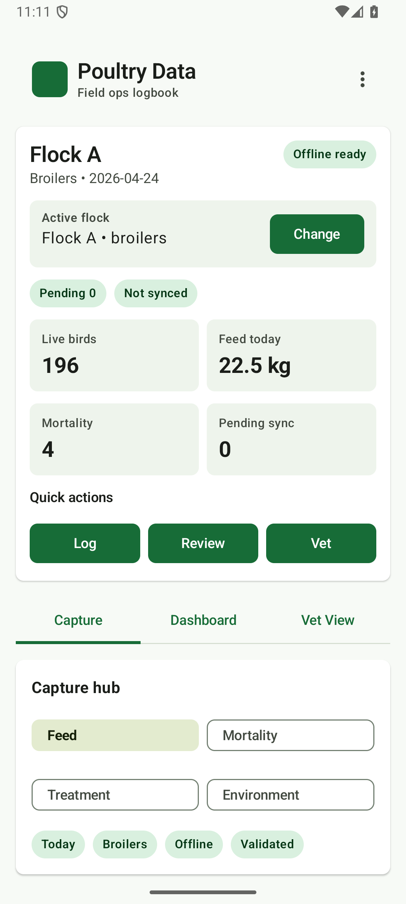
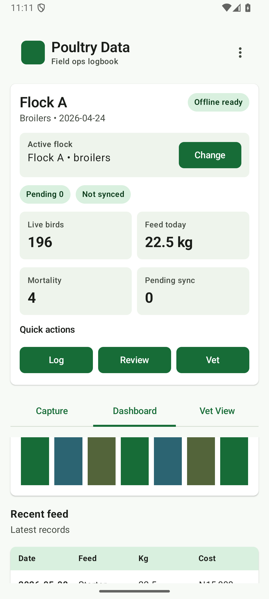
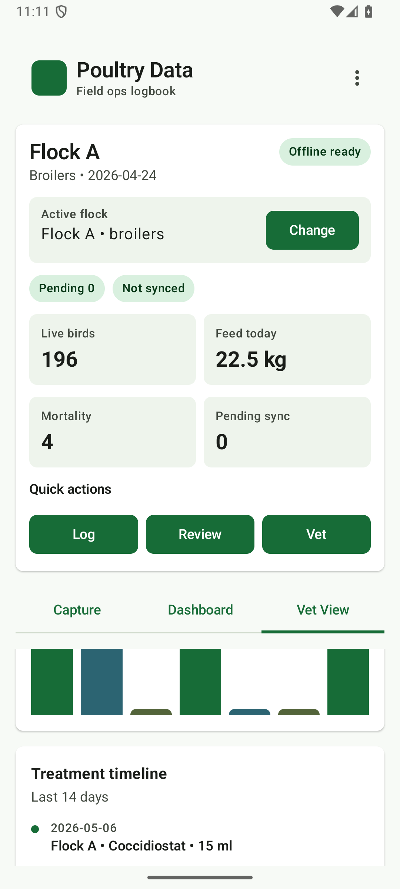
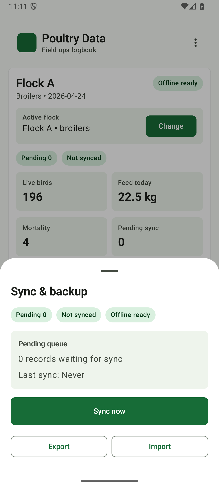
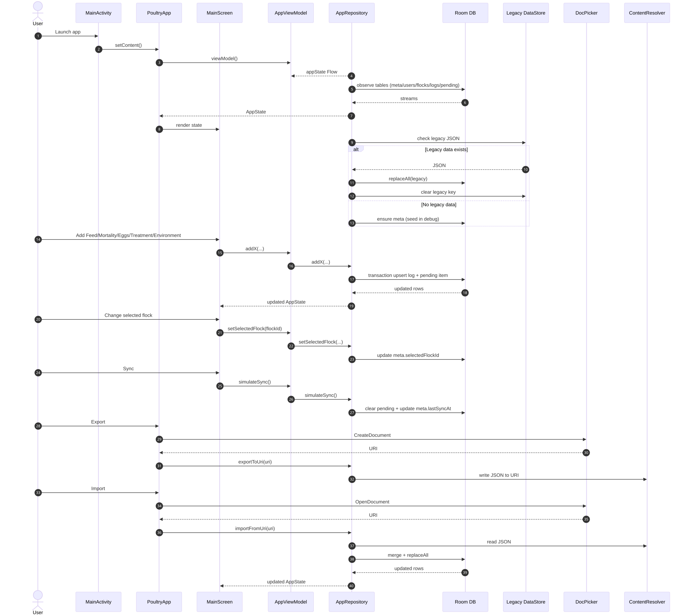

# Data Collect (Poultry Farm)

Offline-first Android app for capturing poultry farm operations data in the field. The app demonstrates Compose UI, ViewModel state, Room persistence, import/export workflows, and local unit coverage around data behavior.

## Overview

- Built for farm operators who need to log feed, mortality, egg production, treatments, and environment readings without depending on a network connection.
- Uses a single observable `AppState` so the UI renders from database-backed state.
- Keeps an offline pending queue for future sync work while the current app stays usable as a local-first data collection tool.
- Includes host-side unit tests for pure Kotlin behavior.

## Screenshots

| Capture | Dashboard | Vet View | Sync & Backup |
| --- | --- | --- | --- |
|  |  |  |  |

## Tech Stack

- Kotlin
- Jetpack Compose and Material 3
- Android Architecture Components: `ViewModel`, `StateFlow`, lifecycle runtime
- Room for local persistence
- DataStore for one-time legacy JSON migration
- Kotlin serialization for import/export payloads
- JUnit 4 local unit tests
- Gradle Android Plugin with Java 17 target

## Architecture



- UI: Compose screens in `app/src/main/java/com/example/data_collect/ui`
- State: `AppViewModel` exposes `StateFlow<AppState>` to the UI
- Data: `AppRepository` combines Room flows into one `AppState`, handles import/export, and writes offline pending items
- Storage: Room entities, DAO, database, and mappers live in `app/src/main/java/com/example/data_collect/data/local`
- Migration: legacy JSON in DataStore is migrated once into Room on startup
- Decisions: [docs/decisions.md](docs/decisions.md)

## Data Model

- `AppState` is the root snapshot: farm info, flocks, logs, pending queue, selected flock, and sync metadata
- Core entities: `User`, `Flock`
- Log types: `FeedLog`, `MortalityLog`, `EggLog`, `TreatmentLog`, `EnvLog`
- `PendingItem` acts as the offline outbox for future sync

## What This Demonstrates

- Offline-first Android data capture with Room as the source of truth
- Unidirectional UI rendering from observable state
- Domain/entity mapping between app models and persistence models
- Practical mobile form workflows for real-world operations data
- Import/export boundary for backup or handoff workflows
- Focused local tests for pure Kotlin logic that does not need a device

## Build And Test

```bash
./gradlew :app:assembleDebug
./gradlew :app:testDebugUnitTest
```

Optional full local verification script:

```bash
./scripts/verify-android.sh
```

The script defaults to `clean assembleDebug testDebugUnitTest lintDebug`. Connected Android tests are not run unless `RUN_ANDROID_TESTS=1` is set and an emulator/device is available.

## Project Notes

- Mermaid source lives at `docs/sequence.mmd`.
- Debug seed data includes one broiler flock and one layer flock so reviewers can exercise feed, mortality, egg, treatment, environment, dashboard, and vet-summary flows.
- This repo is a proof project, not a production farm-management backend.
